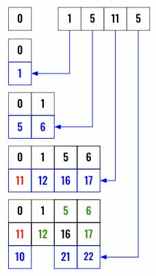

> All diagrams presented herein are original creations, meticulously designed to enhance comprehension and recall. Crafting these aids required considerable effort, and I kindly request attribution if this content is reused elsewhere.
{: .prompt-danger }

> **Difficulty** :  Easy
{: .prompt-tip }

> DP
{: .prompt-info }

## Problem

Given an integer array `nums`, return `true` *if you can partition the array into two subsets such that the sum of the elements in both subsets is equal or* `false` *otherwise*.

**Example 1:**

```
Input: nums = [1,5,11,5]
Output: true
Explanation: The array can be partitioned as [1, 5, 5] and [11].
```

**Example 2:**

```
Input: nums = [1,2,3,5]
Output: false
Explanation: The array cannot be partitioned into equal sum subsets.
```

## Solution

Before we get started with any solution, the following is very clear. We need to use the elements in any order and find if they could make two groups each having sum equal to `target`. 

```python
if sum(nums)%2==1:
  return False

target = sum(nums)//2
```

### DFS Solution

Seems fairly straightforward from a DFS solution standpoint. We can use **template 2** that we have already discussed [here](https://adeveloperdiary.com/algorithm/backtracking/combination-sum/).

The idea is not to find two sets of group, rather just find one path which leads to the target. Since we know the actual sum is double than the `target` then the remaining numbers **must** be added to make the other `target` value.

:fire: Now if we restructure the problem to this - " Find if the elements of an array can make the target value when used only once", it becomes much simpler to implement and we can use the same intuition when implementing using the dynamic programming approach.

Start with the terminating conditions, if the current `target==0` then we know we have successfully reached to the end, so can return `True`, conversely if the `target` anytime is negative then we know we have overshoot the `target` and current path can not reach to a valid `target`, so we return `False`.

```python
def dfs(index, target):
  if target == 0:
    return True
  if target < 0:
    return False
```

Now if we still have a positive `target`, we can loop and consider every other elements to find the target. If we ever find a `True` immediately return it. In case there is no success, return `False` at the end of the loop.

```python
  for j in range(index,len(nums)):
    if dfs(j+1, target - nums[j]):
      return True
  return False
      
```

Finally call `dfs()` and return its return.

```python
return dfs(0,target)
```

Even though this is a valid code, it will take `O(2^n)` time, hence won't pass LeetCode, however we will use the similar concept below to implement using the dynamic programming. 

### Dynamic Programming

As discussed earlier we will use the same intuition. We need to find a target sum by using the numbers only once from an array. One way we can do this in `O(n)` time is for every element we find the sum for every combination. The space complexity will be large though.

Below is an example, we are going to iterate through the array from left to right and keep all the summations in a `set`. Initially we start with a set having just a `0` as base case. Then we add `1` and keep both. Then we take `5`, find the new summations and append them to the set as well (`0 + 5 = 5, 1 + 5 = 6`). We can keep doing this till the end of the loop.



If we have  `target` in the `set` then we know we can reach it using the numbers to we return `True`. The best part is, we don't even have to wait for the loop to complete, we can return `True` as soon as there is a `target` in the `set`. 

```python
cache = set([0])
for i in range(len(nums)):
  copy_of_cache=cache.copy()
  for digit in copy_of_cache:
    cache.add(nums[i]+digit)
    # We do not have to wait for the loop to complete.
    if target in cache:
      return True

return False
```

## Final Code

Here is the full code. 

### DFS 

```python
def can_partition(nums):
    if sum(nums) % 2 == 1:
        return False
    
    target = sum(nums)//2  
    
    def dfs(index, target):
        if target == 0:
            return True
        if target < 0:
            return False
        for j in range(index,len(nums)):
            if dfs(j+1, target - nums[j]):
                return True
        return False   
    return dfs(0, target)
```

### Dynamic Programming

```python
def can_partition(nums):
    if sum(nums) % 2 == 1:
        return False

    target = sum(nums)//2
    cache = set([0])
    for i in range(len(nums)):
        copy_of_cache = cache.copy()
        for digit in copy_of_cache:
            cache.add(nums[i]+digit)
            
        # We do not have to wait for the loop to complete.
        if target in cache:
            return True

    return False
```
