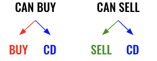
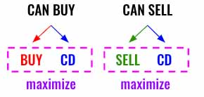
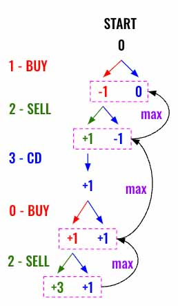

> All diagrams presented herein are original creations, meticulously designed to enhance comprehension and recall. Crafting these aids required considerable effort, and I kindly request attribution if this content is reused elsewhere.
{: .prompt-danger }

> **Difficulty** :  Easy
{: .prompt-tip }

> DFS
{: .prompt-info }

## Problem

You are given an array `prices` where `prices[i]` is the price of a given stock on the `ith` day.

Find the maximum profit you can achieve. You may complete as many transactions as you like (i.e., buy one and sell one share of the stock multiple times) with the following restrictions:

- After you sell your stock, you cannot buy stock on the next day (i.e., cooldown one day).

**Note:** You may not engage in multiple transactions simultaneously (i.e., you must sell the stock before you buy again).

**Example 1:**

```
Input: prices = [1,2,3,0,2]
Output: 3
Explanation: transactions = [buy, sell, cooldown, buy, sell]
```

**Example 2:**

```
Input: prices = [1]
Output: 0
```

## Solution

We will be solving this problem using **DFS**. There are 2 options in each turn. 

1. If can Buy then Buy or cool down 
2. If can Sell then Sell or cool down.



We need to traverse in both the directions, either buy/cool down or sell/cool down and selected which ever provides **max** profit. Since we are going to use `dfs()` the `max` will be starting from leaf nodes at the bottom of the tree and propagate upward.



Here is the visualization for the **Example 1**. This shows only the partial tree, the `max` gets propagated from the leaf nodes to the root node.



Lets start by defining our `dfs()` function. Since the path we can take depends on if we `can_buy` or not (that is `not can_buy ` means sell) and this is going to be different in each node, let's pass that to the `dfs()` function along with the index parameter.

```python
def dfs(i, can_buy):
```

At anytime, if the index `i` reached the end of the prices then we know we cannot make any more profit, so we return `0`.

```python
def dfs(i, can_buy):
  if i >= len(prices):
    return 0
```

Now if we are eligible to buy then we can either buy or cool down. Call `dfs()` by incrementing the `index` and setting `can_buy` to `False`. We also need to **subtract** the **price** from returned profit.

```python
	if can_buy:
  	profit_if_buying_now = dfs(i+1, False) - prices[i]
```

We also need to traverse the path to cool down instead of buying.

```python
		profit_if_cooldown =dfs(i+1, True)
```

Now return the max of both.

```python
		return max(profit_if_buying_now,profit_if_cooldown)
```

Alternatively, if we can sell then sell and skip the next element as we need to cool down after selling. Also add the price to profit.

```python
  else:
    profit_if_selling = dfs (i+2, True) + prices[i]
    profit_if_cooldown =dfs(i+1, False)
    return max(profit_if_selling,profit_if_cooldown)
```

Now call the `dfs()` function.

```python
return dfs(0, True)
```

The above code will work fine, however will get timeout error without memorization/caching. Let's implement that. The `dfs()` function takes two arguments, so that simplest approach is to create a map using both arguments as keys.

```python
cache = {}
def dfs(i, can_buy):
  if i >= len(prices):
    return 0
	
  if (i, can_buy) in cache:
    return cache[(i, can_buy)]
  
  if can_buy:
    profit_if_buying_now = dfs(i+1, False) - prices[i]    
    profit_if_cooldown =dfs(i+1, True)
    cache[(i, can_buy)] = max(profit_if_buying_now,profit_if_cooldown)

  else:
    profit_if_selling = dfs (i+2, True) + prices[i]
    profit_if_cooldown =dfs(i+1, False)
    cache[(i, can_buy)] = max(profit_if_selling,profit_if_cooldown)
 	
  return cache[(i, can_buy)]
```

## Final Code

Here is the full code. 

```python
def maxProfit(prices: List[int]) -> int:        
  cache = {}
  def dfs(i, can_buy):
    if i >= len(prices):
      return 0

    if (i, can_buy) in cache:
      return cache[(i, can_buy)]

    if can_buy:
      profit_if_buying_now = dfs(i+1, False) - prices[i]    
      profit_if_cooldown =dfs(i+1, True)
      cache[(i, can_buy)] = max(profit_if_buying_now,profit_if_cooldown)

    else:
      profit_if_selling = dfs (i+2, True) + prices[i]
      profit_if_cooldown =dfs(i+1, False)
      cache[(i, can_buy)] = max(profit_if_selling,profit_if_cooldown)

    return cache[(i, can_buy)]
  return dfs(0, True)
```
