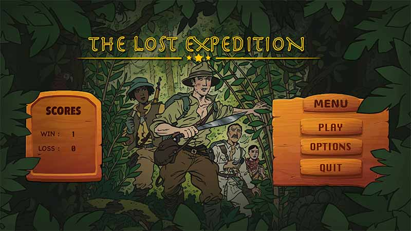
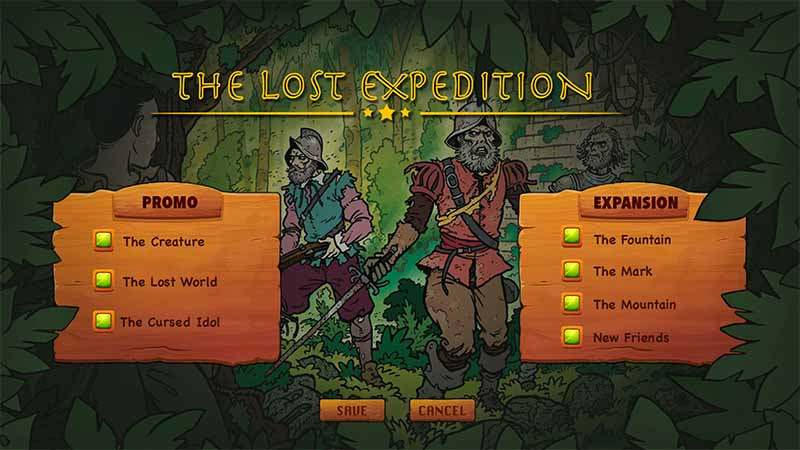
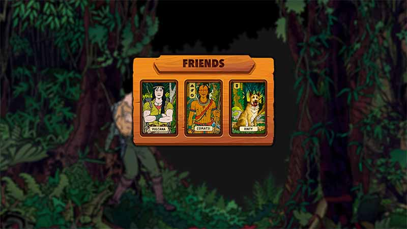
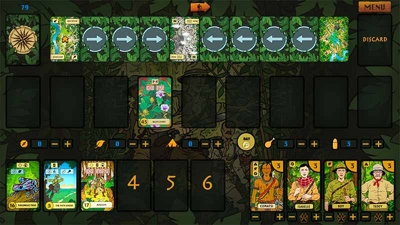
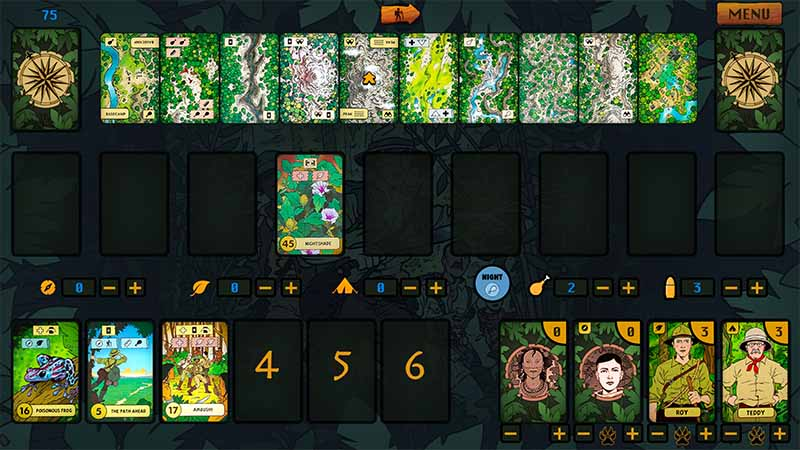
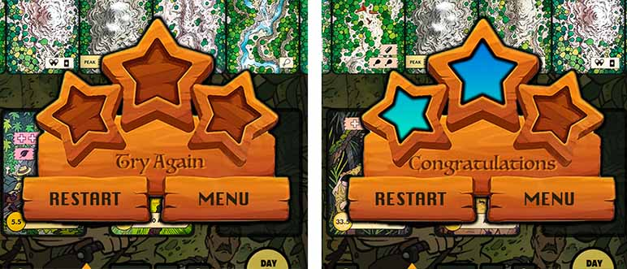

Teaching my child the basics of game programming seemed like a fun and educational project. Little did I know it would turn into an exciting adventure, culminating in the creation of "The Lost Expedition" using PyGame. This blog post recounts my very first journey using pygame, highlighting the essential aspects of game development, including high-level structures, game loops, asset management, and modular design.

As I dove into the project, my primary goal was to make the learning process enjoyable and accessible. I started with the basics of PyGame, exploring how to create a window and draw simple shapes. From there, the project grew organically, evolving into a full-fledged board game.

### High-Level Structure

The foundation of "The Lost Expedition" was built on a clear and organized structure. I divided the game into several key components:

1. **Initialization**: Setting up the game window, loading assets, and initializing game variables.
2. **Game Loops**: Managing multiple game states such as the main menu, gameplay, and game over screens.
3. **Asset Management**: Loading and organizing images, sounds, and other resources.
4. **Design and Gameplay**: Implementing game rules, player interactions, and the overall game flow.
5. **Modularity and Reusability**: Writing reusable code to simplify future enhancements and maintenance.

### Creating Multiple Game Loops

One of the challenges I faced was managing different game states efficiently. I tackled this by creating separate game loops for each state. This approach allowed us to keep the code clean and manageable. Here's a simplified example of how I structured the game loops:

```python
def main_menu():
    while running_main_menu:
        # Handle events
        # Update menu
        # Draw menu

def gameplay():
    while running_gameplay:
        # Handle events
        # Update game state
        # Draw game elements

def game_over():
    while running_game_over:
        # Handle events
        # Update game over screen
        # Draw game over screen

while game_running:
    if current_state == 'main_menu':
        main_menu()
    elif current_state == 'gameplay':
        gameplay()
    elif current_state == 'game_over':
        game_over()

```

### Design and Gameplay

Designing the gameplay mechanics was where the project truly came to life. I brainstormed game rules, player actions, and objectives, translating them into code. I focused on creating a balanced and engaging experience, testing and refining the design iteratively.

### Modularity and Reusability

To ensure the code was modular and reusable, I broke down the game logic into smaller, manageable functions and classes. This approach not only improved code readability but also made it easier to debug and extend the game.

Now, let's go through each scene and various reusable contexts.

## Internal Mechanics

### Main Controller

I created a class for just initiating the main game loop, which then invokes the appropriate scene based on the `current_state`.Here is the actual code:

```python
import pygame

from screens.main_menu import MainMenu
from screens.game_options import OptionMenu
from screens.game_play import GamePlay
from screens.game_start_option import GameStartOption
import json
from base import MAIN_MENU,OPTIONS_MENU,GAME,GAME_START
        
class TheLostExpedition:
    
    def __init__(self) -> None:
        pygame.init()
        pygame.mixer.init()
        
        display_info = pygame.display.Info()
        self.W = display_info.current_w
        self.H = display_info.current_h
    
        self.flags = pygame.FULLSCREEN
        self.clock = pygame.time.Clock()

        self.screen = pygame.display.set_mode((self.W, self.H), self.flags)
        
        self.current_state=[MAIN_MENU]
        
        self.override_play_config()
        
        self.game_states={}        
        self.game_states[MAIN_MENU]=MainMenu(self.W,self.H,self.clock,self.screen,self.current_state)
        self.game_states[GAME_START]=GameStartOption(self.W,self.H,self.clock,self.screen,self.current_state)
        self.game_states[OPTIONS_MENU]=OptionMenu(self.W,self.H,self.clock,self.screen,self.current_state)        
        self.game_states[GAME]=GamePlay(self.W,self.H,self.clock,self.screen,self.current_state)
    
    def override_play_config(self):
        # load and override play config
        with open("game_data.json", "r") as file:
            data = json.loads(file.read())            
            data["play_config"]={}
            
        with open("game_data.json", "w") as file:
            file.write(json.dumps(data))
    
    def run_main_loop(self):
        while True:            
            self.game_states[self.current_state[0]].run()
 

if __name__ == "__main__":    
    
    game=TheLostExpedition()
    game.run_main_loop()

```

The `run_main_loop` is just having one loop to call `run()` from each state/scene based on `current_state`.

### Scene 1: The Landing Page (Main Menu)



I initially designed this in photoshop then used as a background image. I kept the size very low so that it can be rendered fast. Then I used one `Button` class I found online. I modified it by adding more features such as click sound, adding name etc. Here is the code.

```python
class Button:
    def __init__(self, image, pos, text_input, font, base_color, hovering_color,name=""):
        self.image = image
        self.x_pos = pos[0]
        self.y_pos = pos[1]
        self.font = font
        self.base_color, self.hovering_color = base_color, hovering_color
        self.text_input = text_input
        self.text = self.font.render(self.text_input, True, self.base_color)
        if self.image is None:
            self.image = self.text
        self.rect = self.image.get_rect(center=(self.x_pos, self.y_pos))
        self.text_rect = self.text.get_rect(center=(self.x_pos, self.y_pos))
        self.click_sound=pygame.mixer.Sound(f"{ASSET}/audio/click.mp3")
        self.click_sound.set_volume(0.5)
        self.name=name

    def update(self, screen):
        if self.image is not None:
            screen.blit(self.image, self.rect)
        screen.blit(self.text, self.text_rect)

    def checkForInput(self, position):
        if position[0] in range(self.rect.left, self.rect.right) and position[1] in range(self.rect.top, self.rect.bottom):
            self.click_sound.play()
            return True
        return False

    def changeColor(self, position):
        if position[0] in range(self.rect.left, self.rect.right) and position[1] in range(self.rect.top, self.rect.bottom):
            self.text = self.font.render(
                self.text_input, True, self.hovering_color)
        else:
            self.text = self.font.render(
                self.text_input, True, self.base_color)
```

I also stored all the game data in one json file including the score, settings and temporary data. Here is the structure.

```json
{
  "scores": {
    "win": 1,
    "loss": 0
  },
  "options": {
    "the_creature": true,
    "the_lost_world": true,
    "the_cursed_idol": true,
    "the_fountain": true,
    "the_mark": true,
    "the_mountain": true,
    "new_friends": true
  },
  "play_config": {}
}
```

I am not going to have the full code of all the scenes here. However, here is the code the main menu. I am calling `init_background()` and  `init_menu()` from the `__init__()` function. Then from the game loop, I am invoking `render()` and `event()` function. The `current_state` is passed as a list so that the changes are propagated to all the classes (pass by reference).

```python
import pygame
import sys
from base import MAIN_MENU,OPTIONS_MENU,GAME_START, ASSET, GAME
import json
from utils.ui import Button, get_font

class MainMenu:
    def __init__(self,W,H,clock,screen,current_state) -> None:
        self.W=W
        self.H=H
        self.clock=clock
        self.screen=screen
        self.current_state=current_state
        self.sound = f"{ASSET}/audio/menu_audio.mp3"        
        
        self.refresh_options()
        self.init_background()
        self.init_menu()
    
    def refresh_options(self):
        with open("game_data.json","r") as file:
            data=json.loads(file.read())
            self.scores=data["scores"]
            self.options=data["options"]
    
    def init_background(self):
        self.img_bg_game_menu = pygame.transform.scale(pygame.image.load(
            f"{ASSET}/others/menu_bg.jpg").convert(), (self.W, self.H))    
    
    def load_score_data(self):
        self.font_win = get_font("Krungthep", 36).render(str(self.scores["win"]), True, "#370b02")
        self.rect_win = self.font_win.get_rect(center=(366, 668))
        
        self.font_loss = get_font("Krungthep", 36).render(str(self.scores["loss"]), True, "#370b02")
        self.rect_loss = self.font_loss.get_rect(center=(366, 740))
    
    def init_menu(self):
        
        self.start_button = Button(None, pos=(1647, 635), text_input="PLAY", font=get_font(
            "Krungthep", 48), base_color="#5b1900", hovering_color="#360000")
        self.options_button = Button(None, pos=(1647, 731), text_input="OPTIONS", font=get_font(
            "Krungthep", 48), base_color="#5b1900", hovering_color="#360000")
        self.quit_button = Button(None, pos=(1647, 836), text_input="QUIT", font=get_font(
            "Krungthep", 48), base_color="#5b1900", hovering_color="#360000")
        
        self.load_score_data()    
    
    def play_music(self, music_file):
        pygame.mixer.music.stop()
        pygame.mixer.music.load(music_file)
        pygame.mixer.music.set_volume(0.5)                
        pygame.mixer.music.play(-1)        
    
    def render(self):
        self.screen.blit(self.img_bg_game_menu, (0, 0))
        self.screen.blit(self.font_win, self.rect_win)
        self.screen.blit(self.font_loss, self.rect_loss)
        
        for button in [self.start_button, self.options_button, self.quit_button]:
            button.changeColor(self.MOUSE_POS)
            button.update(self.screen)
    
    def event(self):
        for event in pygame.event.get():
            if event.type == pygame.MOUSEBUTTONDOWN:
                if self.start_button.checkForInput(self.MOUSE_POS):
                    if self.options["new_friends"] == True:
                        self.current_state[0]=GAME_START
                    else:
                        self.current_state[0]=GAME
                if self.options_button.checkForInput(self.MOUSE_POS):
                    self.current_state[0]=OPTIONS_MENU
                if self.quit_button.checkForInput(self.MOUSE_POS):
                    pygame.quit()
                    sys.exit()
                
            if event.type == pygame.QUIT:
                pygame.quit()
                sys.exit()
            elif event.type == pygame.KEYDOWN:                    
                if event.key == pygame.K_o:
                    self.current_state[0]=OPTIONS_MENU                
                elif event.key == pygame.K_q:
                    pygame.quit()
                    sys.exit()            
                elif event.key == pygame.K_ESCAPE:
                    pygame.quit()
                    sys.exit()            
    
    def run(self):
        self.refresh_options()
        self.play_music(self.sound)
        while self.current_state[0] == MAIN_MENU:
            self.MOUSE_POS = pygame.mouse.get_pos()
            self.render()
            self.event()
                                    
            pygame.display.flip()
            self.clock.tick(60)
```

### Scene 2: Game Settings

The **Options** takes to the `OPTIONS_MENU`. This is a static scene, except the check boxes. I have included all the available promo cards and expansions. 



I created a new class named `ToggleButton` for implementing button with two states. This will be used in several more places in the game. The code is very similar to `Button`, however this does not show any text and have two images and a state to track which image to render.

```python
class ToggleButton:
    def __init__(self, image1, image2, pos, name=""):

        self.image1 = image1
        self.image2 = image2
        self.pos = pos
        self.state = True
        self.name=name
        self.set_image()
        self.click_sound=pygame.mixer.Sound(f"{ASSET}/audio/click.mp3")
        self.click_sound.set_volume(0.5)

    def set_image(self):
        if self.state == True:
            self.image = self.image1
        else:
            self.image = self.image2
        self.rect = self.image.get_rect(center=(self.pos[0], self.pos[1]))

    def update(self, screen):
        screen.blit(self.image, self.rect)

    def checkForInput(self, position):
        if position[0] in range(self.rect.left, self.rect.right) and position[1] in range(self.rect.top, self.rect.bottom):
            self.click_sound.play()
            return True
        return False

    def toggle(self):
        self.state = not self.state
        self.set_image()
        return self.state

```

### Scene 3: Game Start Options

When the **New Friends**, expansion is enable, we need to choose one of the three options for the friends. So I have created a scene for this as I didn't want to clutter the actual `GamePlay` class.  I used images from the game guide for the background, using generating AI in photoshop I have expanded the images to make it more interesting and full screen. 



Here is the code in the `MainMenu` we saw earlier where the scene is activated when `new_friends` options is `True`.

```python
if event.type == pygame.MOUSEBUTTONDOWN:
  if self.start_button.checkForInput(self.MOUSE_POS):
    if self.options["new_friends"] == True:
      self.current_state[0]=GAME_START
      else:
        self.current_state[0]=GAME
```

Upon selecting a character, I am saving the data to the json file and not passing this as a parameter as this approach can be used for any other game. 

### Scene 4: Game Play

This is the most complicated part with ~800 lines of code. The game play has two main state, **Day** and **Night**. I have used two separate background color temperatures and music to bring more theme into the play. 



The cards are the main part of the GamePlay. I have created a spite class named `PlayingCards` by extending the `pygame.sprite.Sprite` class. I loads the front and back image, deals and flips the card.

```python
class PlayingCards(pygame.sprite.Sprite):        
    def __init__(self,id,image_path,back_img_name,pos) -> None:
        super().__init__()
        
        self.front = False
        self.back_img = pygame.image.load(
            f"{image_path}/{back_img_name}.png").convert_alpha()
        
        self.front_img = pygame.image.load(
            f"{image_path}/{id}.png").convert_alpha()
        
        self.update()
        self.rect = self.image.get_rect(center=pos)
        
    def update(self) -> None:
        if self.front == True:
            self.image = self.front_img
        else:
            self.image = self.back_img

    def deal(self):
        self.front=True
    
    def flip(self):
        self.front = False        
        self.update()
```

Then I am loading all the cards (based on what expansion being selected in the option scene) into a Sprite Group, `pygame.sprite.Group()`. 

```python 
for card in self.cards:
	self.playing_cards.add(PlayingCards(card,image_path="assets/cards_final",back_img_name="back",pos=(116, 202)))
```

One major feature here is the drag and drop. I have used `MOUSEBUTTONUP`, `MOUSEMOTION` and `MOUSEBUTTONDOWN` for this. On `MOUSEBUTTONUP` I am looking for collision between the mouse pos and all the cards then selecting the card. 

```python
def event_game_window(self):
  for event in pygame.event.get():
    if event.type == pygame.MOUSEBUTTONUP:
      if event.button == 1:
        self.event_game_window_mouse_up()

        if event.type == pygame.MOUSEMOTION:
          self.event_game_window_mouse_motion(event)

          if event.type == pygame.MOUSEBUTTONDOWN:
            if event.button == 1:
              self.event_game_window_mouse_down(event)
```

On `MOUSEMOTION` I am moving the selected card based on the mouse position. All the cards are in a `SpriteGroup` here. Then on `MOUSEBUTTONDOWN`, I am simply resetting the currently active card so that it does not get move with the mouse position.

```python
self.playing_cards.sprites()[self.active_card].rect.move_ip(event.rel)
```

In order to make the experience better, I am storing all the predefined position where a card can be placed in an array. Then during `MOUSEBUTTONDOWN` I am finding the closest spot and automatically moving the card there. This provides a magnet like experience where the cards are automatically pulled to the exact position. You can see this the game play video above.

Each card can be flipped by right click, unless they are in deck or in discard pile.

```python
for i, s in enumerate(self.playing_cards.sprites()):
  if s.rect.center not in [(116, 202), (1919, 204)] and s.rect.collidepoint(self.MOUSE_POS):
    if s.front==False:
      s.deal()
    else:
      s.flip()
```

All the leaders are loaded using another `Sprite` class named `Leaders`. Leaders have `expertise` and `defeated` attributes to keep track. 

```python
import pygame

class Leaders(pygame.sprite.Sprite):    
    IMAGE_PATH = "assets/leaders"

    def __init__(self, name,pos,expertise) -> None:
        super().__init__()
        self.name=name
        self.expertise=expertise
        self.defeated = False
        
        self.alive_img = pygame.image.load(
            f"{Leaders.IMAGE_PATH}/{name}.png").convert_alpha()
        self.defeated_img = pygame.image.load(
            f"{Leaders.IMAGE_PATH}/{name}_defeated.png").convert_alpha()
        self.update()
        self.rect = self.image.get_rect(center=(pos[0], pos[1]))

    def update(self) -> None:
        if self.defeated == False:
            self.image = self.alive_img
        else:
            self.image = self.defeated_img

    def defeat(self):        
        self.defeated=True
```

Each leader has associated health which can be incremented or decremented. Same for the resources as well. I have created a map object to have all these stored. This helped to not create many variables and their associations.

```python
self.game_state = {
  "resource": {
    "food": {
      "actions": {
        "inc": None,
        "dec": None
      },
      "value": 3,
      "txt_obj": {
        "text": None,
        "text_rect": None
      }
    },
    "ammunition": {
      ...
    }
  },
  "expertise": {
    "friend": {
      ...
    },
    "compass": {
      "actions": {
        "inc": None,
        "dec": None
      },
      "value": 0,
      "txt_obj": {
        "text": None,
        "text_rect": None
      },
      "txt_obj_health": {
        "text": None,
        "text_rect": None
      },
      "health": 3,
      "health_actions": {
        "inc": None,
        "dec": None
      }
    },
    "leaf": {
      ...
    },
    "tent": {
      ...
    }
  }
}
```

Once clicked on `Day/Night` button, the background image and music will change. Below you can see the game playing using all the expansions and promo cards.



Once the end state has been detected, the result will be displayed. I am using `Victory` class to load various images based on the victory conditions. 

```python
class Victory(pygame.sprite.Sprite):
    IMAGE_PATH = "assets/others"
    
    def __init__(self,pos) -> None:
        super().__init__()
                
        self.win0 = pygame.image.load(
            f"{Victory.IMAGE_PATH}/finish_win0.png").convert_alpha()
        
        self.win1 = pygame.image.load(
            f"{Victory.IMAGE_PATH}/finish_win1.png").convert_alpha()
        
        self.win2 = pygame.image.load(
            f"{Victory.IMAGE_PATH}/finish_win2.png").convert_alpha()
        
        self.win3 = pygame.image.load(
            f"{Victory.IMAGE_PATH}/finish_win3.png").convert_alpha()
        
        self.update()
        self.rect = self.image.get_rect(center=(pos[0], pos[1]))
        
    def update(self,id:int=0) -> None:
        if id == 0:
            self.image = self.win0
        elif id == 1:
            self.image = self.win1
        elif id == 2:
            self.image = self.win2
        else:
            self.image = self.win3
```

Here is the example of Win and Loss. 



Finally, the game loop is very small and optimized. 

```python
def run(self):
  self.init_game_state()
  self.play_music(self.day_sound)
  self.active_card = None
  self.move_meeple = None
  while self.current_state[0] == GAME:
    self.draw_background()
    self.MOUSE_POS = pygame.mouse.get_pos()
    self.render_game_window()
    self.event_game_window()

    pygame.display.flip()
    self.clock.tick(60)
```

## Conclusion

Creating "The Lost Expedition" was not only a rewarding experience but also a valuable learning journey for me. As a first-time PyGame user, I discovered the intricacies of game development, from managing game loops and assets to designing engaging gameplay mechanics. This project opened up a new world of possibilities, blending my passion for tabletop games with the power of digital technology.

Through this process, I gained a deeper appreciation for modularity and reusability in game development, which made the experience smoother and more efficient. Now that I've successfully created my first digital board game, I am excited to continue this journey. I plan to develop more digital versions of tabletop games, each offering a unique blend of traditional gameplay and modern interactivity.

The skills and knowledge I acquired while working on "The Lost Expedition" have laid a solid foundation for future projects. I'm eager to explore new ideas, refine my techniques, and bring more beloved board games into the digital realm. If you're passionate about coding and gaming, I encourage you to dive into PyGame and start your own adventure in game development. Happy coding!


